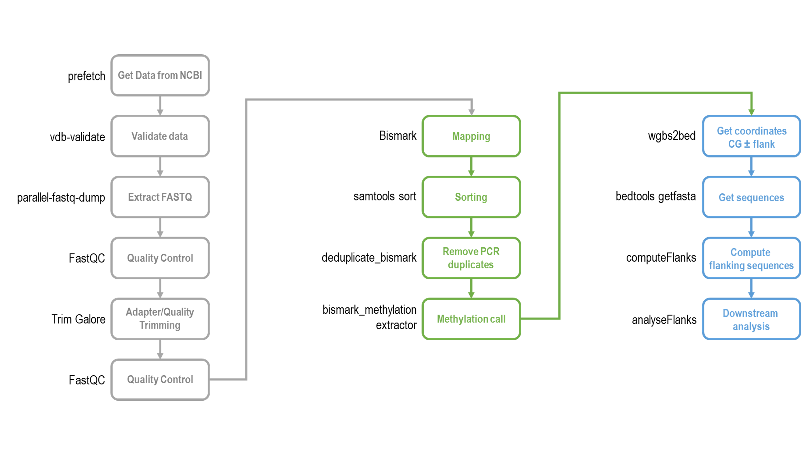
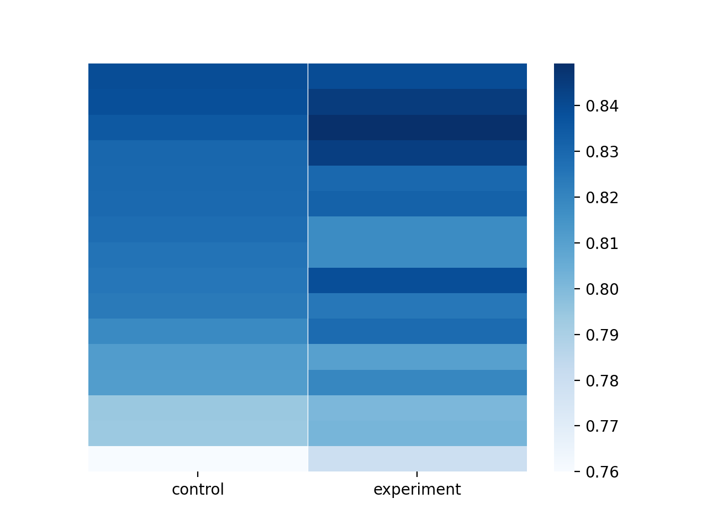
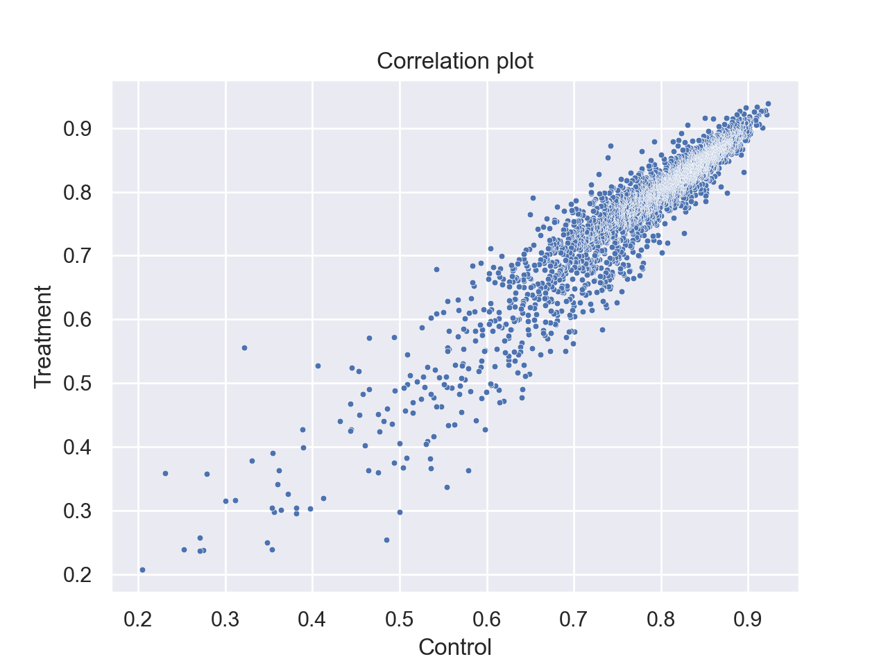
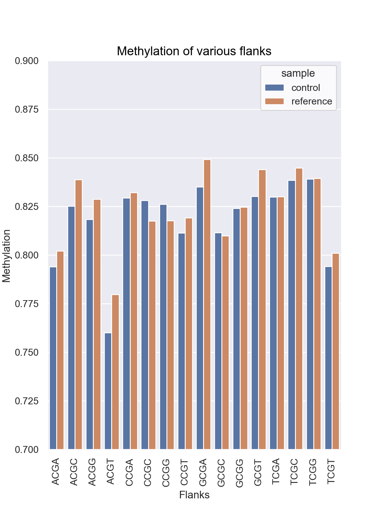

# WGBS2Flanks

This repository contains an exemplary pipeline and scripts to conduct flanking sequence analysis of methylome.

Methylation of genomic DNA is analysed using whole-genome bisulfite sequencing (WGBS). Obtained NGS data can be processed by Bismark (https://github.com/FelixKrueger/Bismark) or BMap (http://itolab.med.kyushu-u.ac.jp/DT/BMap/) programs to compute methylation levels of individual cytosines. Further, various downstream analyses can be carried out, for example, the identification of differentially methylated regions (DMRs) and the investigation of flanking sequences of methylated CpG sites (for more details, please read a review: https://pubmed.ncbi.nlm.nih.gov/34375615/).  

## Installation  

* Pipeline requires installation of external tools listed in `requirements.txt` file. Make sure that they are properly installed acoording to developer's instructions and their locations added to `PATH`.
* Pipeline is implemented in `wgbs_pipeline.py` script, which gets SRA ids and commands from `config.json`.
* Three additional scripts `wgbs2bed.py`, `computeFlanks.py`, and `analyseFlanks.py` available here are needed to perform three steps of the analysis.  

## Pipeline

The steps of the pipeline can be divided into 3 main parts: 1) data cleaning, 2) methylation calling, and 3) flanking sequence analysis:

  

## wgbs2bed.py

Generates a bed file with coordinates of cytosine flanks from WGBS report files.

```
python wgbs2bed.py -i sorted.deduplicated.CX_report.txt -o coordinates.bed
```  

Options:
* `--infile / -i <str>`  
Name of an input file.  

* `--bmap`  
If given, then the script expects an infile generated by `BMap`. By default: `bismark` format is expected.  

* `--outfile / -o <str>`  
Name of an output file.  

## computeFlanks.py

Computes frequences of cytosine methylation in different flanking contexts.

This script takes the output from `bedtools getfasta` and calculates methylation of cytosines for NCGN, NNCGNN and NNNCGNNN flanks. Firstly, a methylation level of idividual cytosines, which has sequencing depth >= a value defined by --depth parameter (default is 10), is computed. Secondly, average methylation of cytosines with identical flanks is calculated.

```
python computeFlanks.py -i coordinates_sequences.txt -d 20 -o results.csv
```  
Options:  

* `--infile / -i <str>`  
Name of an input file.  

* `--outfile / -o <str>`  
Name of an output file.  

* `--depth / -d <int>`  
Sequencing depth threshold for CpG sites to be included in the analysis (default: 10).  

## analyseFlanks.py

Compares flanking preference with reference data

This script takes the output from `computeFlanks.py` and csv file containing reference flanking data as comparison; generates a heatmap, a scatterplot, and a barplot.

```
python analyseFlanks.py -i results.csv -c preferences.csv
```  
Options:  

* `--infile / -i <str>`  
Name of an input csv file(s) generated by `computeFlanks.py`.  

* `--comparison / -c <str>`  
Name of the csv file containing flanks data to be used as comparison.  

## Examplary plots produced by analyseFlanks.py  

  