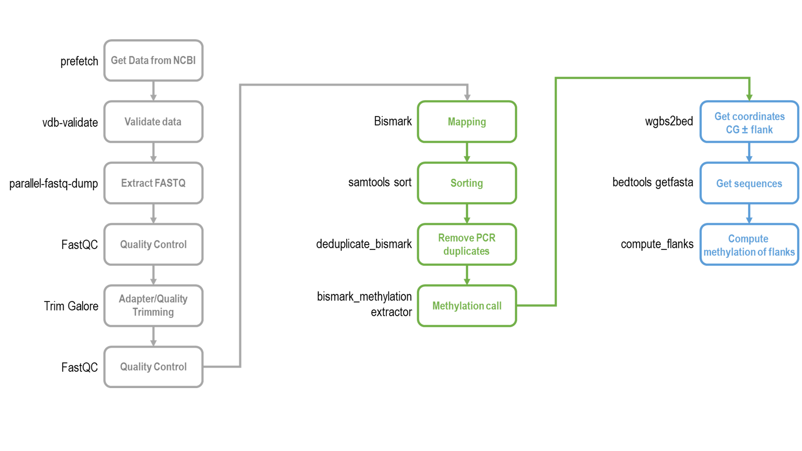

# WGBS2Flanks

This repository contains scripts and an exemplary pipeline to conduct flanking sequence analysis of methylome.

Methylation of genomic DNA can be analysed using whole-genome bisulfite sequencing (WGBS). Obtained NGS data can be processed by Bismark (https://github.com/FelixKrueger/Bismark) or BMap (http://itolab.med.kyushu-u.ac.jp/DT/BMap/) programs to compute methylation levels of individual cytosines. Further, various downstream analyses can be carried out, for example, the investigation of flanking sequences of methylated cytosines (for more details, please read a review: https://pubmed.ncbi.nlm.nih.gov/34375615/).  

## Installation  

* Pipeline requires installation of several tools listed in `requirements.txt` file. Make sure that they are properly installed acoording to developer's instructions and their locations added to `PATH`.
* Pipeline is implemented in `wgbs2flanks_pe_pipeline.sh` script. This implementation is tailored to paired-end sequencing.
* Additional scripts `wgbs2bed.py`, `compute_flanks.py` available here are needed to perform the flanking sequence analysis.  

## Pipeline

The steps of the pipeline can be divided into 3 main parts: 1) data cleaning, 2) methylation calling, and 3) flanking sequence analysis:

  

## wgbs2bed.py

Generates a `bed` like file with coordinates of cytosine flanks from WGBS report files.

```
python wgbs2bed.py --infile sorted.deduplicated.CX_report.txt --outfile coordinates.bed
```  

Options:
* `--infile <str>`  
Name of an input file (Bismark or BMap report).  

* `--outfile <str>`  
Name of an output file.  

* `--bmap`  
If given, then the script expects an infile generated by `BMap`. By default: `bismark` format is expected.  

## compute_flanks.py

Computes cytosine methylation in different flanking contexts.

This script takes as an input a `txt` file produced by `bedtools getfasta` and calculates methylation of cytosines for NCGN, NNCGNN and NNNCGNNN flanks. Firstly, a methylation level of idividual cytosines, which has sequencing depth >= a value defined by --depth parameter (default is 10), is computed. Secondly, average methylation of cytosines with identical flanks is calculated.

```
python compute_flanks.py --infile sequences.txt --outfile flanks.csv --depth 10
```  
Options:  

* `--infile <str>`  
Name of an input file.  

* `--outfile <str>`  
Name of an output file.  

* `--depth <int>`  
Sequencing depth threshold for cytosines to be included in the analysis (default: 10).  

* `--motif <str>`  
Motif to analyse, default is CG, other options are CA, CT, CC.  

* `--level`  
This option allows the usage of files that contain values of methylation level but no sequencing depth data.  

* `--distribution`  
Computes the number of observations of each flank in a sample/genome. Does not analyse methylation of flanks.  

## Links  
* Our review on flanking sequence analysis
    * https://pubmed.ncbi.nlm.nih.gov/34375615/
